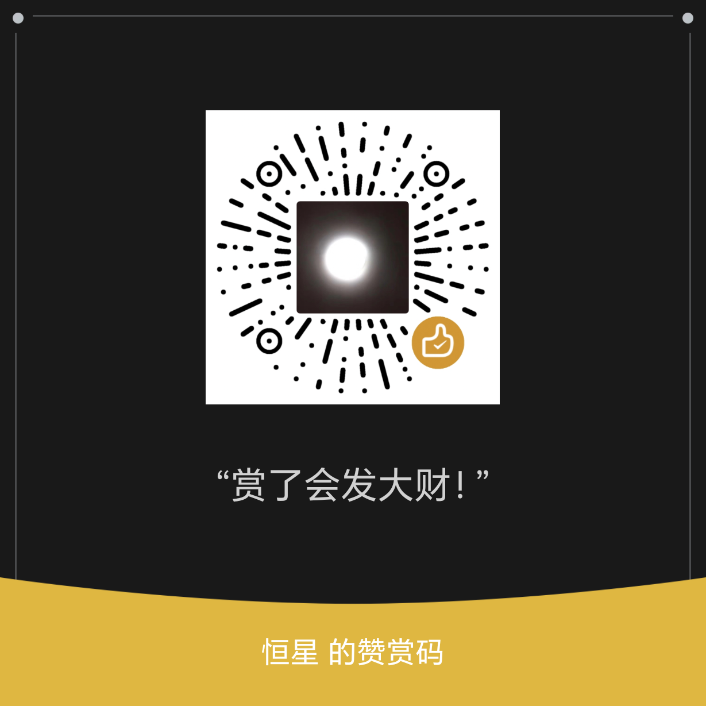

# XMUAssistantSignBot

面向厦门大学校内系统的助手型 QQ 机器人。基于 [NapCat](https://github.com/NapNeko/NapCatQQ)（OneBot v11）接入 QQ，使用 Rust 实现，覆盖统一身份认证登录、学习通/教务查询、以及课堂考勤（签到）的自动化。

针对 OneBot v11 在“大文件”“富文本”场景下能力有限的问题，项目内置一个基于 `axum` 的 Web 暴露（Expose）子系统：机器人在群内回复简短说明与外链，实际的文件下载、题库渲染、扫码登录页等则由内置 Web 服务承载。

---

## 核心功能

- **登录与会话管理**：统一身份认证扫码登录、账号密码登录；登录态在多子系统（学习通 LNT / 教务 JW）间自动维护，并带失败回退。
- **考勤签到**：查询签到任务、自动签到（数字 / 雷达）、定向签到、面向全体已登录用户的批量签到、以及按课程时间表的定时签到。
- **教务与学习通**：课程表查询与图片渲染、课程资料下载、课堂互动与随堂测验查询、考试/作业与答案查询。
- **Web 暴露子系统**：大文件流式下载外链、HTML 试卷转 Markdown 预览与 PDF 导出、登录/扫码等交互页面。
- **自然语言查询**：课程、资料、课表等查询已抽象为可被大模型调用的工具（`ChooseCourse` / `ChooseFiles` / `ChooseTimetable`），可用自然语言描述代替精确参数。
- **校园网出口（可选）**：通过 SecureLink 建立校园网通道，`*.xmu.edu.cn` 请求可经本地 SOCKS5 分流从校园出口发出。详见「校园网出口」一节。

---

## 指令一览

指令前缀为 `/`。`/help` 会在编译期自动汇总各指令的用法生成帮助文本，无需手工维护。

### 登录与账号

| 指令 | 用法 | 说明 |
|---|---|---|
| `/login` | `/login` | 扫码登录学校系统。 |
| `/logout` | `/logout` | 删除已保存的登录数据。 |
| `/loginpwd` | `/loginpwd` | 发起账号密码登录。 |
| `/logoutpwd` | `/logoutpwd` | 删除已保存的账号密码登录数据。 |

### 签到

| 指令 | 用法 | 说明 |
|---|---|---|
| `/sign` | `/sign` | 查询当前可用的签到任务及其 ID。 |
| `/autosign` | `/autosign` | 对最新的数字与雷达签到自动签到。数字签到会缓存并复用首个成功的签到码；雷达签到优先使用课程时间表定位，其次使用签到位置缓存，均失败则逐个尝试。建议先用 `/signtime` 存好时间表以提升命中率。 |
| `/specsign` | `/specsign <ID>` | 对指定签到 ID 执行数字 / 雷达签到，`<ID>` 通过 `/sign` 获取。 |
| `/pushsign` | `/pushsign <ID>`（别名 `/push`） | 对所有已登录用户的指定签到 ID 执行数字 / 雷达签到。 |
| `/signtime` | `/signtime <描述>` | 存储/刷新课程位置时间表（用于雷达签到短路定位），存储后自动开启定时签到。该操作会伴随一次登录。 |
| `/delsigntime` | `/delsigntime` | 删除已存储的课程时间表与定时签到状态。 |
| `/signapi` | `/signapi` | 获取签到相关 API 的暴露地址。 |

### 学校系统

| 指令 | 用法 | 说明 |
|---|---|---|
| `/timetable` | `/timetable <描述>` | 查看指定周次的课程表（`<描述>` 说明学期、周数等）。该操作会伴随一次登录。 |
| `/download` | `/download <描述>` | 下载指定课程的文件。后端用大模型识别课程与文件；未指明具体文件时下载该课程全部文件，结果以 Web 外链形式提供。 |
| `/class` | `/class <描述>` | 查询指定课程的课堂互动信息（大模型识别课程）。 |
| `/getclass` | `/getclass <ID>` | 查询指定课堂互动小测的内容，`<ID>` 通过 `/class` 获取。 |
| `/test` | `/test <描述>` | 查询指定课程的测试/作业信息（大模型识别课程）。 |
| `/gettest` | `/gettest <ID>` | 查询指定小测的题目内容，`<ID>` 通过 `/test` 获取。 |
| `/testans` | `/testans <ID>` | 查询指定小测的答案（以教师公布为准）。 |

### 校园网

| 指令 | 用法 | 说明 |
|---|---|---|
| `/flushvpn` | `/flushvpn` | 创建 SecureLink 登录网页并发送链接。扫码 / 点击登录后，在网页粘贴浏览器最终跳转到的 callback 地址即可完成 SSO，服务端刷新会话；网页亦可查看/刷新 VPN 配置信息。 |

### 其它

| 指令 | 用法 | 说明 |
|---|---|---|
| `/help` | `/help` | 查看全部指令帮助。 |
| `/echo` | `/echo <内容>` | 原样返回内容，用于测试系统可用性。 |
| `/github` | `/github` | 返回本项目的 GitHub 地址。 |

### 扫码推送

对于需要现场扫描二维码的签到场景，本项目提供配套的移动端扫码推送方案。
1. 直接发送图片，机器人会进行识别并且推送扫码结果
2. 移动端扫码工具读取二维码内容后，将解析结果提交到该 API，由机器人服务端统一处理签到请求。

配套客户端仓库：xmu_sign_qr。该客户端基于 Kotlin Multiplatform / Compose 实现，主要用于在 Android / iOS 设备上调用相机扫码，并把扫码结果推送给本项目暴露的签到 API。

基本流程：

使用移动端扫描课堂签到二维码。
客户端将二维码解析结果提交给机器人服务端。
服务端对所有已登录账号并发执行本次扫码签到推送，并在 QQ 内返回处理结果。

xmu_sign_qr 仓库的 GitHub Actions 会构建 Android APK 与 iOS IPA，可在对应 Actions 构建产物中获取。iOS 产物通常为未签名 IPA，需要根据实际设备与签名方式自行处理安装。

---

## 架构概览

- `src/logic`：指令处理。每个指令是一个带 `#[handler(...)]` 过程宏的异步函数，由 `build.rs` 在编译期扫描注册，`help_msg` 亦在编译期聚合为 `/help`。
- `src/web`：基于 `axum` 的 Web 暴露子系统，`build.rs` 按目录自动组装路由。主要模块：`file`（大文件流式下载）、`md`（Markdown 预览与 PDF 导出）、`login` / `vpn`（登录与 SecureLink 登录页）、`timetable`、`rollcall`。
- `src/api`：学校服务客户端（`xmu_service` 下的统一认证 / 学习通 / 教务）、网络层 `SessionClient`（自管理 Cookie 与重定向）、存储（`redb`）、二维码与视频处理等。
- `src/abi`：OneBot 接入层，通过 WebSocket 与 NapCat 通信（事件流 + API 流）。
- 大模型：通过 `genai` + `llm_xml_caster` 使用 DeepSeek，仅用于课程/资料/课表等结构化选择，不用于闲聊。

运行期配置见 `src/config.rs`（NapCat 地址与端口、机器人 QQ、指令前缀、数据目录 `./data` 等）。

---

## 构建

项目依赖 `opencv`（二维码识别）与 `ffmpeg`（视频处理）等原生库，直接 `cargo build` 常因缺少 `LIBCLANG_PATH` 等环境变量而失败。请使用下述脚本。

### 本地开发（Windows / Linux / macOS）

`scripts/cargo.ps1` 会自动探测 libclang 并配置环境变量（Windows 另注入 MSVC STL 版本放行宏），随后把参数原样转发给 `cargo`。需要 PowerShell 7（`pwsh`）与 LLVM/Clang。

```bash
pwsh scripts/cargo.ps1 build --release
pwsh scripts/cargo.ps1 check --message-format=short
pwsh scripts/cargo.ps1 test -- --nocapture
```

### 发布构建（Alibaba Cloud Linux 3 目标）

`scripts/build-alinux3.ps1` 在 Alibaba Cloud Linux 3 容器内编译，产出可在 alinux3 服务器直接运行的二进制，并把非 glibc 的动态库（OpenCV / FFmpeg 等）一并打包到 `data/lib`。需要 Docker。

```powershell
# 默认参数即可；首次会构建 scripts/Dockerfile.alinux3 定义的构建镜像
pwsh scripts/build-alinux3.ps1

# 常用参数
#   -BinaryName <name>    目标二进制名（默认 xmu_assistant_bot）
#   -Proxy <url>          构建/运行代理（默认 http://host.docker.internal:7890；直连留空）
#   -NoCache              不使用镜像缓存
#   -Clean                构建前 cargo clean
#   -SkipImageBuild       跳过镜像构建，仅复用已有镜像编译
```

产物为项目根目录下的 `run` 与 `data/lib/`，将二者上传到服务器同一目录即可运行（二进制通过 `$ORIGIN/data/lib` 的 rpath 加载随包动态库）。

---

## 运行

1. 部署并启动 NapCat，开启 OneBot v11 的正向 WebSocket，与 `src/config.rs` 中的地址端口一致。
2. 按需在 `src/config.rs` 配置机器人 QQ、NapCat 地址端口等。
3. 启动机器人（`run` 或 `cargo run --release`）。数据默认存放在 `./data`。

### 校园网出口（可选）

若希望 `*.xmu.edu.cn` 的请求从校园网出口发出，可运行 SOCKS5 中间层镜像 `vintcessun/xmu_secure_link_docker`（内部运行 SecureLink 客户端，仅将校园目标经隧道转发）。机器人侧通过 `SessionClient` 将 `*.xmu.edu.cn` 走 `socks5h://127.0.0.1:1080`，其余直连；代理地址可用环境变量 `XMU_SOCKS5_PROXY` 覆盖，置空则全部直连。镜像用法见其仓库说明。

---

## 致谢

- [xmu_secure_link](https://github.com/XMU-MoYu-Club/xmu_secure_link)：厦大 SecureLink（OpenVPN3）客户端。本项目的 `/flushvpn` 登录中转、以及 `*.xmu.edu.cn` 经校园网出口（SOCKS5 分流）均基于该项目实现；配套容器镜像见 Docker Hub `vintcessun/xmu_secure_link_docker`。
- [NapCat](https://github.com/NapNeko/NapCatQQ)：提供 OneBot v11 接入，机器人通过它与 QQ 通信。

---

## 开源协议

本项目源代码与 Release 以 **AGPL-3.0-only**（GNU Affero 通用公共许可证 v3）开源，完整文本见根目录 [`LICENSE`](LICENSE)。

---

## 支持项目

本项目为个人开源项目，代码和 Release 均按 AGPLv3 协议公开发布。赞助完全自愿，不构成购买服务、功能解锁、技术支持优先权或任何形式的付费代办。

请在遵守所在学校/机构规则、系统使用条款和相关法律法规的前提下使用本项目。本项目不鼓励、不支持任何代签、伪造出勤、绕过考勤规则、滥用账号或影响学校系统正常运行的行为。

如果这个项目的代码实现、工程结构或学习价值对你有帮助，可以自愿赞助支持维护。


