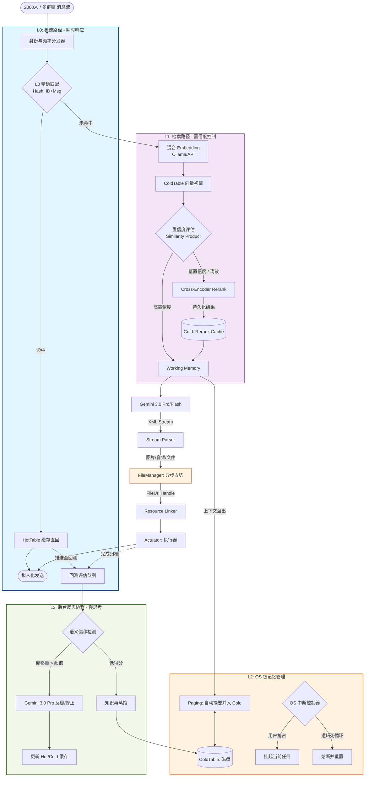

```mermaid
graph TB
    %% 1. 流量入口与极速层 (System 1: 直觉)
    Input([2000人 / 多群聊 消息流]) --> Dispatcher[身份与频率分发器]
    
    subgraph L0_FastPath [L0: 极速路径 - 瞬时响应]
        Dispatcher --> HashMatch{L0 精确匹配<br/>Hash: ID+Msg}
        HashMatch -- "命中" --> FastGet[HotTable 缓存直回]
        FastGet --> QuickOut([拟人化发送])
        FastGet -. "推送至回测" .-> BacktestQueue
    end

    %% 2. 检索与置信度层 (Retrieval & Rerank)
    subgraph L1_SearchPath [L1: 检索路径 - 置信度控制]
        HashMatch -- "未命中" --> Embed[混合 Embedding<br/>Ollama/API]
        Embed --> VectorSearch[ColdTable 向量初筛]
        VectorSearch --> ConfCheck{置信度评估<br/>Similarity Product}
        
        ConfCheck -- "低置信度 / 离散" --> Rerank[Cross-Encoder Rerank]
        Rerank -- "持久化结果" --> RerankCache[(Cold: Rerank Cache)]
        
        ConfCheck -- "高置信度" --> WorkingMem[Working Memory]
        RerankCache --> WorkingMem
    end

    %% 3. MemGPT 内存与中断管理 (OS Kernel)
    subgraph MemGPT_OS [L2: OS 级记忆管理]
        WorkingMem -- "上下文溢出" --> Paging[Paging: 自动摘要并入 Cold]
        Paging <--> ColdDB[(ColdTable: 磁盘)]
        
        Interrupt{OS 中断控制器}
        Interrupt -- "用户抢占" --> StopCurrent[挂起当前任务]
        Interrupt -- "逻辑死循环" --> CircuitBreaker[熔断并重置]
    end

    %% 4. 后台反思与回测系统 (System 2: 逻辑反思)
    subgraph ReflectionDaemon [L3: 后台反思协程 - 慢思考]
        BacktestQueue[回测评估队列] --> DriftCheck{语义偏移检测}
        DriftCheck -- "偏移量 > 阈值" --> ReThink[Gemini 3.0 Pro 反思/修正]
        ReThink --> PatchCache[更新 Hot/Cold 缓存]
        
        DriftCheck -- "低得分" --> ReDistill[知识再蒸馏]
        ReDistill --> ColdDB
    end

    %% 5. 推理与执行 (Multi-modal Execution)
    WorkingMem --> GeminiBrain[Gemini 3.0 Pro/Flash]
    GeminiBrain -- "XML Stream" --> Parser[Stream Parser]
    
    Parser -- "图片/音频/文件" --> FileSys[FileManager: 异步占坑]
    FileSys -- "FileUrl Handle" --> Linker[Resource Linker]
    
    Linker --> Actuator[Actuator: 执行器]
    Actuator --> QuickOut
    Actuator -. "完成归档" .-> BacktestQueue

    %% 样式美化
    style L0_FastPath fill:#e1f5fe,stroke:#01579b,stroke-width:2px
    style MemGPT_OS fill:#fff3e0,stroke:#e65100,stroke-width:2px
    style ReflectionDaemon fill:#f1f8e9,stroke:#33691e,stroke-width:2px
    style L1_SearchPath fill:#f3e5f5,stroke:#7b1fa2
    style FileSys fill:#fff3e0,stroke:#e65100
```

